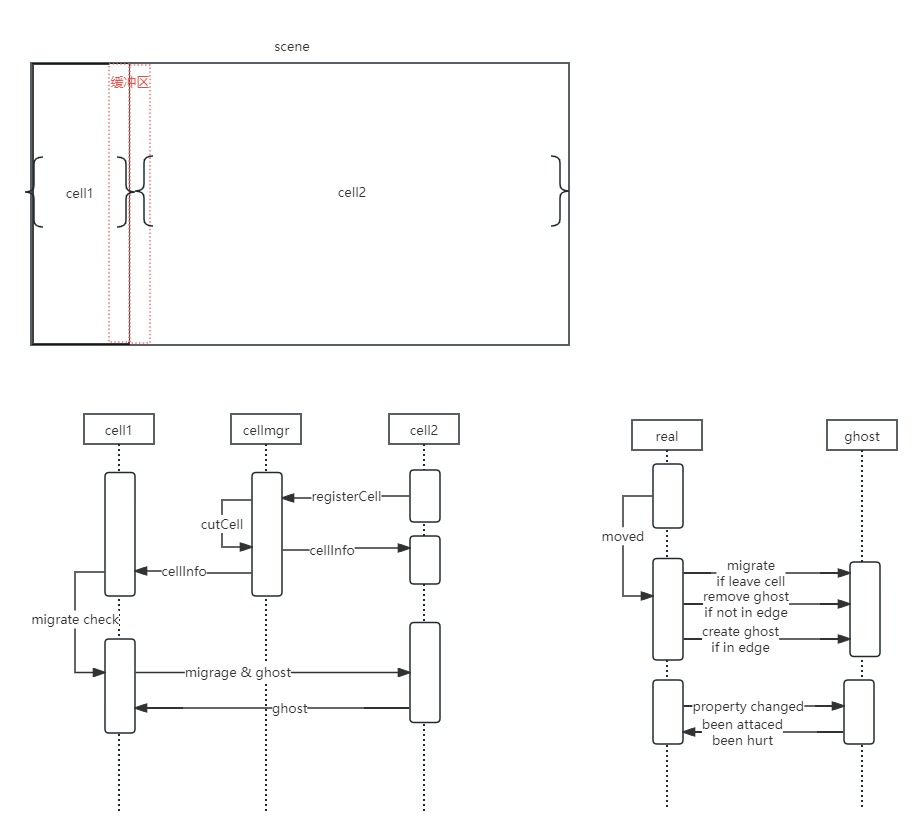

# gameserver
## 基于nanoserver直接改造的的mmrpg server, 小部分代码雷同
* gate -- 网关服务器
* master- 集群master服务器, 处理用户选择创建等
* game - 游戏场景逻辑服务器, 可以多开，每个game对应1个或多个场景管理
* web 登录http服务 + html client demo
* aoi下载于开源：https://github.com/knight0zh/aoi
* nanaserver: https://github.com/ouyangzhongmin/nanoserver
* nano: https://github.com/ouyangzhongmin/nano

## 启动
导入docs/jsmx.sql到mysql,修改configs/config.toml配置,然后分别运行cmd/master、gate、game、web start_server.sh启动所有服务，
内置html demo: http://localhost:12307/static/client/

## 目前问题:
```aiignore
1.hero 推送消息在同屏数据量大时消息会堵塞,nano作者在agent.push内会丢弃超过agentWriteBacklog(16)缓冲区的数据，我加了个消息合并发送的方式,
目前测试使用的是json序列化，生产如果是mmrpg类建议改为bytes

2.game服务器重启entity数据都丢失了，无法做到重启用户无感知，可以参考goworld方式将entity全部序列化到文件，重启时载入

3.目前实现的视野刷新问题，如果同屏1万人在线，那么服务器的视野刷新处理计算非常高, 不适合大量同屏的处理

4.目前的game主要实现的是aoi 同步等逻辑，业务功能模块可以再新加一个node进程来实现，更新重启也不会影响用户

5.nano内部没有开放单独的rpc接口提供给内部不同node之间的相互调用，目前的nano为fork版本，单独修改了一个nano.NewRpcSession(gateAddr string)
接口，但是使用时需要很多地方注意session的正确区别于用户的session使用，否则很容易出现难排查的问题，
相同的场景需要通过cellId来路由对应的cell服务器
```

## 无缝大地图实现逻辑:
代码分支: `feature/cell`
```aiignore
动态将scene分割成 n 个 区域（cell）只做横向切割。
每个game进程内每个scene只能管理一个cell, 由master的 CellManager 服务器分配管理，
每启动一个cell, 将scene 重新按宽度均匀分布切割为多1个cell，cell内将数据重新迁移分布。
cell边界通过Real->Ghost切换来实现无缝的逻辑。
建议每次启动新的cell时需要间隔小段时间等待数据迁移完成再启动下一个。
```
